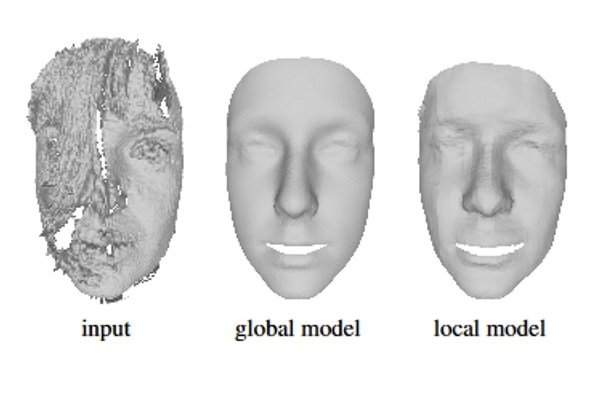
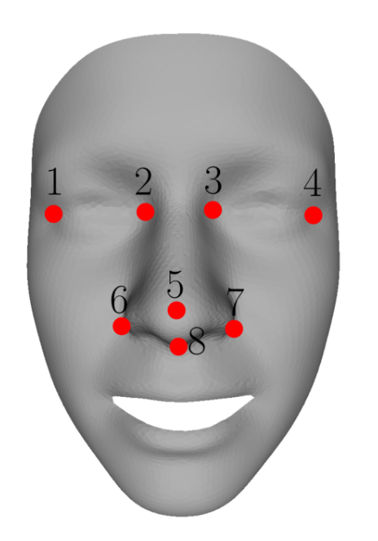

## Statistical 3D face models of different subjects in neutral expression

The provided program fits a global principal component analysis (PCA) model (subfolder global) or a local wavelet PCA model (subfolder local) to a point cloud or triangle mesh as described in the [scientific publication (CVIU 2014)](https://www.google.com/url?q=https%3A%2F%2Farxiv.org%2Fpdf%2F1209.6491.pdf&sa=D&sntz=1&usg=AFQjCNFcR03CTbX1M0HCckejnKQdYvNpzg). 

<p align="center"> 

</p>

### Global PCA model (subfolder global)

##### Setup

The provided code has dependencies on the following libraries:
* Insight Segmentation and Registration Toolkit ITK (http://www.itk.org/). We recommend using ITK 4.50.
* CLapack (http://www.netlib.org/clapack/). Clapack must be compiled using Blas (USE BLAS WRAP must be enabled when using CMake). We recommend using Clapac 3.2.1.
* Approximate Nearest Neighbor Library ANN (http://www.cs.umd.edu/~mount/ANN/). We recommend using ANN 1.1.2.

To setup the provided code, use CMake and specify the required ITK, Clapack and ANN paths. Successfully compiling the project outputs a MM_Restricted_PCA.exe. The provided code has been developed and tested under Windows 7.

##### Usage

To run the program, the MM_Restricted_PCA.exe must be called with following 6 parameters, separated by a blank.
* pcaModel.rmm - full path of the used PCA model. This parameter should point to the NE00_Scaled.rmm.
* templateMesh.off - full path of the training data template mesh, needed for the mesh structure of the result. This parameter should point to the MeanFace_NE00_Scaled.off.
* templateLmks.txt - full path of a text file including the landmark (x y z)-coordinates of the template mesh, the first 8 landmarks are used to compute a rigid alignment. This parameter should point to the ScaledAlignedLandmarks.txt.
* targetData.off - full path of the fitting target point cloud or triangle mesh.
* targetLmks.txt - full path of a text file including the landmark (x y z)-coordinates of the target face mesh, the first 8 landmarks are used to compute the rigid alignment.
* outFitting.off - full path of the fitting result file.

##### Example

The provided example RegisterTestPCA.cmd fits the PCA model to a point cloud named stereo_pointcloud.off with specified landmarks stereo pointcloud landmarks.txt and outputs the fitted mesh as OFF-file named stereo pointcloud fitting.off. To run the example, all paths within the RegisterTestPCA.cmd must be adjusted to point to the specified files. By exchanging the parameters of the target data, target landmarks and output fitting file name, this can be used to fit any other target OFF-file.

### Local wavelet PCA model (subfolder local)

##### Setup

The provided code has dependencies on the following libraries:
* Glut (http://user.xmission.com/ nate/glut.html). We recommend using Glut 3.7.6.
* Glew (http://glew.sourceforge.net/). We recommend using Glew 1.10.0.
* OpenCV (http://opencv.org/). We recommend using OpenCV 2.4.8.
* CLapack (http://www.netlib.org/clapack/). Clapack must be compiled using Blas (USE BLAS WRAP must be enabled when using CMake). We recommend using Clapac 3.2.1.
* Approximate Nearest Neighbor Library ANN (http://www.cs.umd.edu/~mount/ANN/). We recommend using ANN 1.1.2.

To setup the provided code, use CMake and specify the required Glut, Glew, OpenCV, Clapack and ANN paths. Successfully compiling the project outputs a LocalWaveletPCA.exe. The compiled libraries glut32.dll, glew32.dll and ANN.dll, and the shader objects diffuse.fs, diffuse.vs, DisplayDispMap.fs, DisplayImage.fs, TemplateDisparityMap.fs, TemplateDisparityProject.vs, TemplateGeometryMap.fs and TemplateGeometryProject.vs must be copied into the generated project folder.

##### Usage

To run the program, the LocalWaveletPCA.exe must be called with following 6 parameters, separated by a blank.
* modelPath - path of the folder where the model (std shape 0.bsgw, reduct_tran_shape_0.bsgw) and the learned mean shape (mean_shape_0.bsgw) are located.
* templateMesh.off - full path of the training data template mesh, needed for the mesh structure of the result. This parameter should point to the MeanFace_NE00_Scaled.off.
* templateLmks.txt - full path of a text file including the landmark (x y z)-coordinates of the template mesh, the first 8 landmarks are used to compute a rigid alignment. This parameter should point to he ScaledAlignedLandmarks.txt.
* targetData.off - full path of the fitting target point cloud or triangle mesh.
* targetLmks.txt - full path of a text file including the landmark (x y z)-coordinates of the target face mesh, the first 8 landmarks are used to compute the rigid alignment.
* outFitting - path and file name of the fitting result (file name without file ending). The final fitting result is called outFitting.off.

##### Example

The provided example RegisterTestLocalWaveletPCA.cmd fits the PCA model to a point cloud named stereo pointcloud.off with specified landmarks stereo pointcloud landmarks.txt and outputs the fitted mesh as OFF-file named stereo pointcloud fitting.off. To run the example, the project path within the RegisterTestLocalWaveletPCA.cmd must be adjusted. By exchanging the parameters of the target data, target landmarks and output fitting file name, this can be used to fit any other target OFF-file.

### Landmarks

<p align="center"> 

</p>

The landmark files for the global and local model fitting contain the concatenated (x y z)-coordinates of 8 specified landmarks, all coordinates separated by a line break. These landmarks are used to compute a rigid alignment between the target data and the local coordinate system of the model. The landmarks in the figure are recommended, since they are relatively invariant to expression changes.

### Target data

The target data for the global and local model fitting need to be provided in an OFF-file format. Point clouds and triangle meshes are supported.

### License
The source is provided for NON-COMMERCIAL RESEARCH PURPOSES only, and is provided as is WITHOUT ANY WARRANTY; without even the implied warranty of fitness for a particular purpose. The redistribution of the code is not permitted.

### Citing

When using this code in a scientific publication, please cite 
```
@article{Brunton:CVIU:2014:Review,
  title = {Review of statistical shape spaces for {3D} data with comparative analysis for human faces},
  author = {Brunton, Alan and Salazar, Augusto and Bolkart, Timo and Wuhrer, Stefanie},
  journal={Computer Vision and Image Understanding},
  volume={128},
  pages={1--17},
  year={2014}
}
```

### Acknowledgement

This work has been partially funded by the Saarland University, Cluster of Excellence MMCI.

